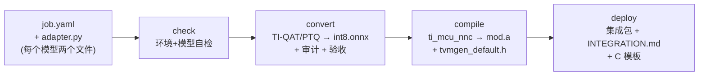

# torch2tinpu — PyTorch → TI NPU 转换 / 部署工具工程

把**任意 PyTorch 训练的模型**转换成 TI C2000 器件（F28P55 等）可执行的
NPU 部署包：`mod.a` + `tvmgen_default.h` + CCS 集成说明 + C 调用模板。

> 本仓库同时保留 **saw2sin 案例**的完整记录（原理 / 坑位 / 复现 / **板端实测**）：
> [`docs/saw2sin_case.md`](docs/saw2sin_case.md)（当时的原始脚本与编译产物在 `case_saw2sin/`）。

---

## 1. 一图看懂



三条命令 = 一条龙（在 ti-npu 环境）：

```powershell
E:\anaconda\envs\ti-npu\python.exe -m torch2tinpu check   examples\saw2sin\job_saw2sin.yaml
E:\anaconda\envs\ti-npu\python.exe -m torch2tinpu all     examples\saw2sin\job_saw2sin.yaml
# 产物在 examples\saw2sin\out\saw2sin\ (int8 ONNX / 审计 / 编译 / deploy 集成包)
```

---

## 2. 每个模型要做的两件事

### 2.1 `adapter.py` —— 模型与数据接口（唯一要写代码的地方）

```python
def get_model():            # [必需] 已加载权重的 float 模型 (torch.nn.Module)
def get_example_input():    # [必需] batch=1 样例输入, 形状即部署静态形状
def sample_batch(n):        # [QAT 必需] 随机训练批次 (x, y)
def get_calibration_batches(n):  # [PTQ 可选] 校准输入
def get_eval_inputs(n):     # [验收可选] 验收输入集
def evaluate(predict):      # [验收可选] 自定义领域指标 (float 与 int8 各跑一次)
```

完整契约说明见 [`torch2tinpu/adapter.py`](torch2tinpu/adapter.py) 顶部；
可运行的完整示例见 [`examples/saw2sin/adapter_saw2sin.py`](examples/saw2sin/adapter_saw2sin.py)。

### 2.2 `job.yaml` —— 转换任务书（全部有默认值）

```yaml
name: my_model              # ASCII 输出名
adapter: { path: adapter_my_model.py }
quant:
  method: qat               # qat (微调) | ptq (仅校准)
  weight_bitwidth: 8        # 2 / 4 / 8
  total_epochs: 15
  iters_per_epoch: 200
  batch_size: 256
  learning_rate: 2.0e-4
compile:
  target_device: F28P55
  target_module: timeseries # timeseries | image | audio | radar
  task_type: generic_timeseries_regression
deploy: { enabled: true, generate_c_template: true }
```

完整字段表与注释见 [`examples/saw2sin/job_saw2sin.yaml`](examples/saw2sin/job_saw2sin.yaml)。

---

## 3. 命令行与产物

| 命令 | 作用 |
|---|---|
| `check` | 环境 + adapter + 模型自检；已有 int8 ONNX 时附带审计 |
| `convert` | Stage A：TI-QAT/PTQ 量化 → `int8.onnx` + 审计 + float/int8 验收 |
| `compile` | Stage B：modelmaker 编译 → `mod.a` + `tvmgen_default.h` + 报告解析 |
| `deploy` | Stage C：生成集成包（`INTEGRATION.md` + `<name>_npu.h/.c` 模板）|
| `all` | convert → compile → deploy |

产物目录结构（`<out_dir>/<name>/`）：

```
<name>_int8.onnx        TI-QAT int8 模型
audit_report.md         编译前审计报告 (FC 形态/通道约束/量化格式)
verify_report.json      float vs int8 验收 (含 adapter.evaluate 自定义指标)
run_info.json           本次运行的全部参数与结果记录
compile/
  modelmaker_job.yaml   生成的编译配置 (纯 ASCII)
  run.log               编译日志 (含 NPU 卸载报告与内存报告)
  summary.md            解析后的编译摘要
  work/                 modelmaker 原始工作目录
deploy/
  artifacts/mod.a + tvmgen_default.h
  INTEGRATION.md        CCS 集成步骤 (自动引用板端例程路径)
  <name>_npu.h/.c       调用模板 (单入单出模型)
```

---

## 4. 工具自动处理的坑（全部来自本工程实测）

| 坑 | 处理方式 |
|---|---|
| FC 被导出成 MatMul+Add → NPU 零卸载 | 编译前审计预警 + 指引 1x1 卷积等价替换 |
| opset 必须 18（否则 ORT 融合行为不同）| 默认值 + 审计复核 |
| batch 必须静态 =1 | 样例输入强制校验 |
| 编译配置缺 `quantization: 2` → hard 降级 soft | 自动写入 + 防呆校验（改别的值直接报错）|
| 编译 YAML 含中文被 TI 脚本按 GBK 读崩 | 生成时强制纯 ASCII（非 ASCII 自动转义）|
| 编译需要 `C2000_CG_ROOT`，VS Code 旧终端不继承 | 自动探测 `E:\ccs\...\ti-cgt-c2000_*.LTS` 并注入子进程 |
| modelmaker 输出路径随 CWD 漂移 | 子进程 CWD 固定到 `compile/work/`，产物统一收集 |
| 卸载报告只有日志没有结构化数据 | 解析 `run.log` → `summary.md`（卸载表/内存/警告）|

---

## 5. 环境要求（已就绪）

| 项 | 值 |
|---|---|
| Python 环境 | conda env `ti-npu`（`E:\anaconda\envs\ti-npu\python.exe`）|
| 工具链 | tinyml-tensorlab（本地源码 editable 安装）+ ti_mcu_nnc 2.1.2 |
| 交叉编译器 | C2000 CGT（自动探测；也可在 job 里显式指定）|
| 参考例程 | C2000Ware `libraries\ai\examples\arc_fault`（集成时对照）|

---

## 6. 已知限制

- 模型必须可被 **torch.fx 符号追踪**（与 TI 官方流程一致）：动态控制流/数据依赖分支不支持；
- 全连接层以 MatMul 形态出现时**回落 CPU**（TI 编译器只认 Gemm）；时序类模型建议直接用 1×1 卷积表达（见案例 §3）；
- 1×1 卷积（PWCONV）要求输入/输出通道为 **4 的倍数**，否则该层回落 CPU（可用零填充通道规避）；
- 编译产物只能来自本工具的 TI-QAT/PTQ 量化（ORT QDQ / fbgemm 等通用量化上不了 NPU，审计会报 error）；
- `target_device` 可换其它器件，但部署段配置 / 例程参照以对应器件的 C2000Ware 例程为准。

---

## 7. 目录结构

```
torch2tinpu/            工具包 (check/convert/compile/deploy/all)
examples/saw2sin/       可运行示例 (adapter + job)，产物输出到 out/
docs/saw2sin_case.md    saw2sin 案例完整记录 (含板端实测 637.6µs/次)
case_saw2sin/           案例归档 (原始脚本 / 编译产物 / 对照实验)
```
