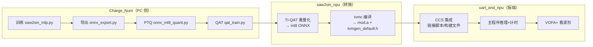
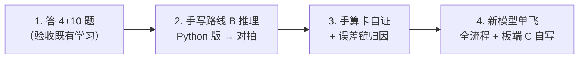

# 04 三工程学习盘点与教学大纲

> 生成日期：2026-10-06
> 覆盖工程：`Charge_Num`（原理与数值层）、`ti-npu\saw2sin_npu`（转换与工程层）、`CCS\uart_and_npu`（板端集成层）
> 对照文档：《边缘部署与具身智能学习规划》（下称"目标文档"）

---

## 0. 这份文档是干什么的

它回答三个问题，并把答案拆成可以逐条打勾的**学习清单 + 教学大纲**：

1. **哪些是要学的**（认知层）——允许看讲解、看教具；标准是"合上资料能复述"。
2. **哪些是应该掌握的**（能力层）——标准是"离开教程能独立再做一遍，可查官方文档，但不靠 AI 代做"。
3. **哪些是必须脱离 AI 手写的**（产出层）——标准是"从空白开始 + 能对拍验证 + 能讲设计决策"。

> **怎么用**：先读 §1、§2 建立全局；把 §3/§4/§5 当验收清单用（每条做完打勾）；
> §6 是"不必手写"的黑盒清单（防止把精力花错地方）；§9 是推荐推进顺序；§10 是题库。

---

## 1. 全局地图：三个工程是同一条链的三个断面



**三者关系一句话**：Charge_Num 造出"能用的模型"，saw2sin_npu 把它"翻译成 NPU 能吃的 int8 图并编译成库"，uart_and_npu 把库"塞进芯片跑起来并验证"。

**一个必须能讲清的关键点**：为什么 Charge_Num 里已经做过 PTQ/QAT，ti-npu 里还要再做一次量化？
→ 因为 **Charge_Num 的两份 int8 都是"通用 CPU 量化"**（fbgemm / ORT QDQ），只能跑 CPU；**NPU 只认 TI-NPU QAT 产生的 int8**（权重 scale 必须是 2 的幂、图里用 right_shift 等专用算子表达）。同一个模型、两次量化，是硬件约束逼出来的。

---

## 2. 能力三层模型（判定标准）

| 层 | 名称 | 允许什么 | 不允许什么 | 合格判据 |
|---|---|---|---|---|
| ① | **要学的**（认知层） | AI 讲解、教具演示、查文档 | 只会说"跑通了" | 合上资料，用自己的话复述原理与"为什么" |
| ② | **应掌握的**（能力层） | 查官方文档、用现成工具 | 让 AI 代做关键步骤 | 换一个新模型，不靠 AI 也能走完对应流程并讲清每步 |
| ③ | **必须手写的**（产出层） | 查语法/API、问报错 | AI 代写核心逻辑 | 从空白文件起写，能对拍验证，能讲代码里的设计决策 |

> 对应你们教学协议里的"禁区清单"：**训练脚本、手写 C/C++、模块验收产物——第一版必须出自你的手**。

---

## 3. 第一层：要学的（认知层）

> 学习方式：读文档 + 跑教具 + 复述。每条都给了"检验题"，答不上就是没学到。

### 3.1 任务与数值原理（Charge_Num）

| 主题 | 讲解要点（原理 + 易错点） | 检验 |
|---|---|---|
| 波形整形 / 逐点映射 | 网络学的是 $y=g(s),\ g(s)=-\sin(\pi s)$，输入是**瞬时值**不是时间 → 天然与频率无关。易错：`FREQ` 是"每周期倍频比"，1:1 整形器必须 `FREQ=1` | 为什么换频率误差不变？（1/3/7.5/20× 恒 6.1e-3） |
| 为何避开 spectral bias | 学"固定映射"而非"时间函数"，从源头绕开高频难学 | 一句话说清 |
| MLP 与 MACs | 每层 $a=\sigma(Wx+b)$；参数 4353，乘加 4224。会算而不是背 | 自己推 64×1、64×64、1×64 三层的 MAC |
| ONNX 结构 | 文件 = 接线图（nodes）+ 数字表（initializer）。本模型 = `3×Gemm + 2×Relu` | 不看图说出节点构成 |

### 3.2 量化数学（Charge_Num，核心）

| 主题 | 讲解要点 | 检验 |
|---|---|---|
| 仿射量化 | $q=\mathrm{clamp}(\mathrm{round}(x/S)+Z)$，$\hat{x}=S(q-Z)$ | 手算：$w=0.0836,S=0.001\to q=\mathrm{round}(83.6)=84,\hat{x}=0.084$ |
| 半格定律 | $|x-\hat{x}|\le S/2$；实测 2.80e-3 ≤ 2.81e-3 贴脸验证 | 用上面的数验证误差 4e-4 ≤ 5e-4 |
| per-channel vs per-tensor | 权重每输出通道一把尺子；W1(64×1) 每通道只有 1 个数 → 完全无损 | 为什么 W1 量化误差为 0？ |
| 标定 | 用代表性输入统计每层激活 min/max，决定 scale | 标定集选错会怎样？ |
| PTQ vs QAT | PTQ=训练后标定；QAT=训练时插入伪量化让网络适应误差 | 两者误差代表什么？ |
| STE | `round` 导数处处为 0；`x+(y-x).detach()` 前向=量化值、反向梯度=1 | 不看资料写出 STE 一行 |
| fake-vs-real gap | fake 1.77e-3 vs real 3.92e-2（差 20×）；说明"训练模拟≠真实推理"，必须在最终链路验证 | 自测题（01 文档）第 4 题 |

### 3.3 NPU 与工具链（saw2sin_npu）

| 主题 | 讲解要点 | 检验 |
|---|---|---|
| TI-QAT 为何必须 | 权重 scale 要求 **2 的幂**、专用算子表达 → 通用量化上不了 | 自测题 1 |
| MLP→1×1 卷积等价 | PyTorch 导出 FC 是 `MatMul+独立Add`，TI 编译器只认 `Gemm` → 零卸载；`Linear≡Conv2d(k=1×1)` 数学等价（实测 max diff 3.6e-7） | 自测题 2 |
| NPU 硬件约束 | batch=1；输入/输出/激活 8bit；PWCONV 输入通道须 4 的倍数；FC 8bit 权重须输入特征 ≥16；不满足**自动回落 CPU**（不算错） | 自测题 10 |
| BYOM 只编译 | `dataset.enable:False`、`training.quantization:2`（漏写→hard 静默降级 **soft**=CPU 软库）、YAML 纯 ASCII、opset 18 | 自测题 3、4 |
| 三段翻译器 | TI-QAT（float→int8 图）→ tvmc（int8 图→mod.a）→ CCS（mod.a→.out） | 能白板画三段 |

### 3.4 板端集成（uart_and_npu）

| 主题 | 讲解要点 | 检验 |
|---|---|---|
| 链接与段 | `.rodata.tvm`（只读微码/参数）→ FLASH；`.bss.noinit.tvm`（可写工作缓存）→ RAMGS3 | 自测题 6 |
| 为何放 GS RAM | NPU 是独立硬件，**内存访问通道只覆盖 GS（全局共享）区**，LS 区不可达 | 自测题 6 |
| 库的未定义符号 | mod.a 需要 `NPU_setInstrMem` 等，由 `f28p55x_npu.c` 提供 | 自测题 5 |
| 构建系统两层 | `subdir_vars.mk` 管"编译"，`makefile ORDERED_OBJS` 管"链接" | 自测题 7 |
| 计时 | CPUTimer1 150MHz **递减**计数，`t_start - t_end` 即周期数（无符号相减跨回绕安全） | 自测题 8 |
| 串口协议 | VOFA JustFloat：float 拆 4 字节**小端** + 帧尾 `00 00 80 7F` | 自测题 9 |

---

## 4. 第二层：应掌握的（能力层）

> 标准：换一个新模型，不靠 AI 也能走完，并讲清每一步"为什么"。可查官方文档、可用现成工具。

### 4.1 能力清单

| # | 能力 | 操作要点 | 验收方式 |
|---|---|---|---|
| 1 | 全流程独立操作 | `torch2tinpu check / convert / compile / deploy / all`；产物目录 `out/<name>/` | 新模型自己跑通，逐文件解释产物 |
| 2 | 换模型"三问自查" | ① batch 是否 1？② 用什么量化？③ 算子形态能被硬件匹配吗？ | 拿到新模型 3 分钟内说清三答 |
| 3 | 读卸载报告 | `[X]`=上 NPU、`[ ]`=回落 CPU；warning 写明违反哪条约束 | 能预判某层会不会上 NPU |
| 4 | 读符号/段/内存 | map 文件找 `.rodata.tvm`/`.noinit.tvm`；知道 mod.a 的内存占用 | 编译后能验证段落位与内存 |
| 5 | 精度对齐 | float→PTQ→QAT→TI-QAT→板端，逐级误差归因（4.58e-3→3.14e-2/3.92e-2→4.4e-2） | 能画出误差链并指出主要来源 |
| 6 | CCS 换模型 | 只替换 `artifacts/mod.a`+`tvmgen_default.h` → 重编 → 烧录 → 对拍 | 不查文档说出 5 项改动 |
| 7 | 故障排查 | 教学文档 §8 坑速查 9 条：症状→原因→验证 | 给症状能说定位路径 |
| 8 | 性能数据讲清 | 637.6µs/次、≈120 帧/s 的计时窗口含什么、受什么限制 | 白板画计时窗口 |
| 9 | git 工作流 | 提交/推送/代理/邮箱马甲 | 已达标 ✅ |

### 4.2 新模型接入契约（必须理解，不是背）

`torch2tinpu` 里每个新模型 = **两个文件**（唯一要写代码的地方）：

**`adapter.py`**（模型与数据接口）：

```python
def get_model():            # [必需] 已加载权重的 float 模型 (nn.Module)
def get_example_input():    # [必需] batch=1 样例输入，形状即部署静态形状
def sample_batch(n):        # [QAT 必需] 随机训练批次 (x, y)
def get_calibration_batches(n):  # [PTQ 可选] 校准输入
def get_eval_inputs(n):     # [验收可选] 验收输入集
def evaluate(predict):      # [验收可选] 领域指标（float 与 int8 各跑一次）
```

**`job.yaml`**（转换任务书）：`quant.method(qat|ptq)`、`weight_bitwidth`、`total_epochs`、`compile.target_device` 等，全有默认值。

**编译前审计的 6 条判据**（`torch2tinpu/audit.py`，读懂即掌握"该改哪里"）：
A. opset 应为 18；B. batch 静态=1；C. 量化格式须 TI-NPU 风格（Floor/Clip），不能有 `QuantizeLinear/MatMulInteger`；D. 避免 `MatMul`，FC 走 Gemm 或 1×1 卷积；E. 1×1 卷积通道数为 4 的倍数；F. Gemm 输入特征 ≥16（8bit）。

---

## 5. 第三层：必须脱离 AI 手写的（产出层）

> 这是三个工程里对你**最值钱**的部分。规则：从空白开始、无 AI 代笔、能对拍、能讲决策。

### 5.1 【最高优先】手写 int8 前向推理（路线 B）

**为什么必须手写**：这是"手写量化与前向推理"能力的直接落地（目标文档技术栈盘点的"深度缺失"）；也是你 README 里挂着的待办。它把 §3.2 的公式从"看懂"变成"会做"，直接练"量化反量化"手算卡。

**起步材料**：`saw2sin_qat_state.pt`（含 int8 权重 + 每层 scale）、`saw2sin_int8.onnx`（PTQ 图，可对照）。

**分步思路（你来写，AI 只答 API/报错）**：

```
Step 1  读 checkpoint：打印每层 int8 权重(W_q)、bias、输入/输出 scale
Step 2  写"单层"整数推理：
            q_out = round( (sum(W_q * q_in) + b_q_int) * M )   # M = S_in*S_w/S_out
        理解 M 为什么是浮点乘子、bias 为什么要先吸进整数域
Step 3  串起三层：quantize(s) → L1 → ReLU → L2 → ReLU → L3 → dequantize
Step 4  对拍：与 onnxruntime 跑同一批输入，比较 max|Δ|
Step 5  （进阶）改写成 C，与 mod.a 板端输出对拍
```

**验收**：同一输入下，你的实现与参考实现的 max 误差与量化理论量级一致（~1e-2 级），且你能解释每一处舍入发生在哪。

### 5.2 复述闭环：把题库答完（合资料作答，AI 批改）

- Charge_Num `docs/01_需求与提示词记录.md` 的 **4 个检验问题**（结构/手算/STE/加分分析）
- 教学文档 `教学_从模型到板端全流程.md` §9 的 **10 道自测题**
- 这两组共 14 题是"能毕业"的判据，见本文档 §10 汇总。

### 5.3 手算卡 3 张（对任何模型都要能算）

| 卡 | 要算的东西 | 本工程答案（自证后记下） |
|---|---|---|
| 量化反量化 | 给定 w、S 求 q 与 $\hat{x}$，验证半格 | 见 §3.2 |
| MACs | 逐层乘加累加 | 4353 参数 / 4224 MAC |
| 模型内存 | float / int8 / 编译产物大小 | float ~18KB，int8 ~10KB |

> 推不出来的数字，不许从文档抄第二遍。

### 5.4 板端 C 应用代码：下一个模型自己写

本轮 `empty_driverlib_main.c` 是 AI 写的（属既有事实，**当精读素材**，不必推翻）。但按"模块验收产物必须出自你手"的规矩：
**下一个模型的应用逻辑（输入生成 → 推理调用 → 计时 → 串口帧）从空文件开始你自己写。**

模板骨架（理解后自己敲）：

```c
g_npu_in.input = (void*)g_in;  g_npu_out.output = (void*)g_out;
t_start = CPUTimer_getTimerCount(CPUTIMER1_BASE);
tvmgen_default_run(&g_npu_in, &g_npu_out);
while (!tvmgen_default_finished) { }
t_end = CPUTimer_getTimerCount(CPUTIMER1_BASE);
us = (float)(t_start - t_end) / 150.0f;
```

### 5.5 新模型全流程"单飞"

选一个新任务（如 方波→三角波，或 方波+噪声→正弦），五阶段从零走完：训练 → 导出 → 量化 → 编译 → 板端。
**全程 AI 不写代码**，只回答 API 用法、报错定位、验收提问。这是迁移能力的最终证明。

### 5.6 加分项

- 不看资料写出 STE 伪量化函数并解释；
- 做"首层通道零填充到 4 上 NPU"实验（教学文档 §10）；
- 把同一模型编成 soft/CPU 版，与 NPU 版做同条件耗时对比。

---

## 6. 不必手写的部分（黑盒清单）

> 明确排除，避免"什么都要自己写"的焦虑。

| 对象 | 你的关系 | 底线要求 |
|---|---|---|
| `torch2tinpu/` 工具实现（9 模块 ~1100 行） | 使用者 + 审阅者 | 会用；读懂 `audit.py` 每条检查对应哪条硬件约束 |
| `mod.a` / `tvmgen_default.h` | 消费 TI 编译器产物 | 知道它提供什么 API |
| CCS 自动生成的 makefile 机制 | 理解原理 | 改动照教学文档 §4.4，不深挖 |
| `case_saw2sin/` 旧脚本归档 | git 历史素材 | 需要时查，不用重写 |

---

## 7. 与目标文档的对照

| 目标文档条目 | 本三工程的对应 |
|---|---|
| P1「手写量化推理 + 性能诊断」（永不砍） | 本链正是载体：手写推理（§5.1）+ 637.6µs 性能数据 |
| 六项手算卡 | 命中 3 项：量化反量化、MACs、模型内存 |
| 技术栈"❌ 深度缺失：手写量化与前向推理" | §5.1 直接补 |
| 模块 7「部署理论深化」 | PTQ/QAT、per-channel、校准、耗时分解 —— 全命中 |
| 简历模板（工程师语言 + 实测数据） | 可写：**TI C2000 F28P55 NPU 端到端部署：TI-QAT 量化→tvmc 编译→CCS 集成，板端实测 637.6µs/次，int8 max 误差 4.4e-2，含手写 int8 推理与对拍** |
| 与 RK3588 主线关系 | 共用同一"训练→导出→量化→部署→对拍"心智模型，仅换平台 |

---

## 8. 验收清单（逐条打勾）

**认知层（能复述）**
- [ ] 逐点映射为何频率无关 / 为何避开 spectral bias
- [ ] 手算：量化反量化 + 半格定律验证
- [ ] PTQ vs QAT；STE 一行；fake-vs-real gap 的教训
- [ ] ONNX = 接线图 + 数字表；本模型节点构成
- [ ] NPU 硬件约束表 + 回落机制
- [ ] MLP→1×1 卷积等价（Gemm vs MatMul）
- [ ] BYOM 四关键点；hard vs soft
- [ ] 段/GS RAM/构建系统两层；计时与 JustFloat

**能力层（能独立做）**
- [ ] 新模型独立跑通 `check/convert/compile/deploy`
- [ ] 读卸载报告并做决策
- [ ] 精度链逐级归因
- [ ] CCS 换模型 5 项改动（不查文档）
- [ ] 故障排查路径（9 条坑）

**产出层（脱离 AI）**
- [ ] 手写 int8 前向推理（路线 B）+ 对拍
- [ ] 14 道题合资料作答
- [ ] 3 张手算卡自证
- [ ] 新模型板端应用代码自己写
- [ ] 新模型全流程单飞

---

## 9. 推荐推进顺序



**每一步的 AI 角色**：P1 当考官（批改）；P2 当工具人（答 API/报错，不写）；P3 当考官；P4 当考官 + 工具人（不写代码）。

---

## 10. 题库汇总（复述用）

### A. Charge_Num 4 题（`docs/01_需求与提示词记录.md`）
1. 模型文件里的"知识"分两部分存，分别是什么？
2. 笔算：$w=+0.0836,\ S=0.001$，$q$ 是多少？反量化回来？遵守半格定律吗？
3. 为什么 QAT 能训练？（`round` 导数？STE 靠什么绕过？）
4. （加分）PTQ 误差 4.28e-2→3.14e-2，而 fake-vs-real gap 仍 3.7e-2，说明什么？

### B. 教学文档 §9 10 题（`教学_从模型到板端全流程.md`）
1. 为什么 fbgemm 量化的 int8 上不了 NPU？TI-QAT 保证错了什么？
2. MLP 直导为何 NPU 零卸载？根因与解法。
3. 导出时 opset 为什么必须 18？漏了后果？
4. BYOM 配置里哪个字段不加会静默降级成 CPU 软库？
5. `mod.a` 链接时还缺哪些函数？由哪个文件提供？
6. `.bss.noinit.tvm` 为什么不能放 LS RAM？NPU 只能访问哪类内存？
7. 新加一个 `.c` 文件，构建系统里要改哪两处？各管什么？
8. 推理计时窗口含哪些环节？为什么用递减计数相减？
9. JustFloat 帧格式？本工程 21 个通道各是什么？
10. 卸载报告 `[X]/[ ]` 什么意思？举一个"被拒回落"的真实例子和硬件原因。

> 答完 A、B 两组（共 14 题），把本文档 §8 的认知层清单全部打勾——"能复述"这一层就毕业了。
