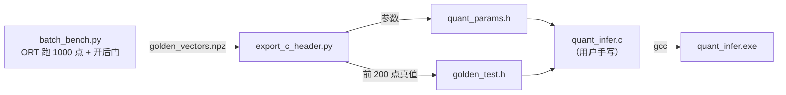

# 06 手写 int8 推理 · C 版（PC 编译，2026-10-07 打通）

> 前置：`05_手写int8推理实战.md`（Python 版已打通，逐位一致）
> 工具链：MinGW gcc（`E:\mingw64\bin\gcc.exe`，已在 PATH 里）
> 分工：`quant_infer.c` = **用户手写**；`export_c_header.py` / `smoke_params.c` = AI 写的工具

---

## 0. 目标与结论

**目标**：把这套整数前向逻辑改写成 C，本机编译运行，与 onnxruntime 真值**逐位对拍**。

**结论（2026-10-07）**：

| 对拍对象 | 规模 | 结果 |
|---|---|---|
| 第 1 层 int8 中间张量 `q1` | 200 点 × 64 = 12800 个整数 | **max diff = 0** |
| 第 2 层 int8 中间张量 `q2` | 200 点 × 64 = 12800 个整数 | **max diff = 0** |
| 输出 `y` | 200 点 | **2.980e-008** |

> **关键证据**：C 版的 `2.980e-008` 与 Python 版的 `2.9802322387695312e-08` **是同一个数**——
> 说明 double 精度对齐、`nearbyint` 取偶舍入、运算顺序全部精确复现。

---

## 1. 文件分工

| 文件 | 性质 | 内容 |
|---|---|---|
| `export_c_header.py` | **工具**（AI） | 从 `saw2sin_int8.onnx` + `golden_vectors.npz` 生成下面两个头文件 |
| `quant_params.h` | 生成物 | `qlayer_t` 结构体 + 三层参数（`W_q` / `S_w` / `b_int` / scale / zp）+ `LAYERS[3]` |
| `golden_test.h` | 生成物 | 测试向量：`G_S[N_TEST]`、`G_Y[N_TEST]`、`G_Q1[N_TEST][64]`、`G_Q2[N_TEST][64]`（ORT 真值） |
| `quant_infer.c` | **本体**（用户） | `quant_layer()` + `main()` 对拍循环 |
| `smoke_params.c` | 工具 | 编译预检：验证头文件可编译、参数读得对 |

**数据流水线**：



> 所有数据在**编译期**固化进二进制——**C 程序运行时不读任何文件**，这与板端做法一致。

---

## 2. 编译

### 2.1 一条命令

```powershell
gcc -O2 -Wall quant_infer.c -o quant_infer.exe
.\quant_infer.exe
```

| 参数 | 作用 | 说明 |
|---|---|---|
| `-Wall` | 打开所有警告 | **永远加**——8 个 C 坑里有一半它能直接抓出来 |
| `-O2` | 优化等级 2 | 学习阶段可用 `-O0`（编译快、调试准）；发布用 `-O2` |
| `-g` | 加调试信息 | 用 gdb 单步调试时需要 |
| `-lm` | 链接数学库 | Linux 需要；**MinGW/Windows 不需要** |

### 2.2 编译的 4 个阶段

```text
quant_infer.c
   │ ① 预处理  展开 #include / #define / 条件编译      → .i
   │ ② 编译    翻译成汇编                              → .s
   │ ③ 汇编    汇编 → 机器码目标文件                   → .o
   │ ④ 链接    .o + 系统库 → 可执行文件                → .exe
```

分开做：`gcc -c quant_infer.c -o quant_infer.o`（①②③）+ `gcc quant_infer.o -o quant_infer.exe`（④）。

> **与板端的联系**：CCS 里 `subdir_vars.mk` 管的是"哪些 .c 参与②③"，`makefile` 的 `ORDERED_OBJS` 管的是"哪些 .o/.a 参与④"——同一套概念。

### 2.3 三个常用变体

```powershell
gcc -Wall -fsyntax-only quant_infer.c      # 只查语法/警告（最快）
gcc -O2 -Wall -S quant_infer.c -o q.s      # 生成汇编, 看编译器把代码变成了什么
gcc -O0 -g -Wall quant_infer.c -o q.exe    # 带调试信息 + 不优化
```

---

## 3. numpy → C 翻译对照表

### 3.1 运算对照

| Python / numpy | C 怎么写 | 坑 |
|---|---|---|
| `np.clip(x, lo, hi)` | **C 没有此函数，必须手写** `if` 判断 | 见 §4 |
| `np.round(x)`（**.5 取偶**） | `nearbyint(x)` | ⚠️ C 的 `round()` 是 .5 **远离零**，不一致 |
| `W.T` | **不用实现**——改索引即可 | 见 §3.2 |
| `A @ B` | 手写双层循环 | — |
| `np.abs(a-b).max()` | 循环 + `fabs()` / 手动取绝对值 | 整数用 `abs()` / `labs()` |
| `x.astype(np.int32)` | `(int32_t)x` 强制转换 | 显式写 |
| 广播 `acc * M` | **展开回循环**：`M` 的形状是 `(out,)` → 放进已有的 `o` 循环 | C 没有广播 |

### 3.2 `W.T` 为什么"消失"

`q_in @ W_q.T` 展开就是 $\text{out}[o] = \sum_i q_{in}[i]\cdot W_q[o][i]$，
而行主序存储里 $W_q[o][i]$ 就是 `W_q[o * in_dim + i]`——**一次内存拷贝都不需要**。

> **翻译心法**：把 numpy 公式手写展开成求和式，再照着求和式写 C 下标，`.T` 自动消失。

### 3.3 广播"寄生"在已有循环里

| numpy 广播 | C |
|---|---|
| 标量 op 数组 | 把标量写进循环体，**不为它开循环** |
| `(out,)` op `(out,)` | 复用**已有的** `o` 循环 |
| `(in,)` op `(out,)`（外积） | **才**需要新开循环 |

判断方法：**看数组的下标语义与哪条循环变量的语义一致**。

### 3.4 类型选择与推导

| Python 变量 | numpy dtype | C 声明 | 依据 |
|---|---|---|---|
| `q_in` / `q_out` | int32 数组 | `const int8_t *` / `int8_t *` | 存储用窄类型省内存 |
| `W_q` | int8 | `const int8_t *` | 同上 |
| `S_w` / `b_int` | float32 / int32 数组 | `const float *` / `const int32_t *` | per-channel |
| `S_in` / `S_out` | float64 标量 | `double` | 对齐 numpy 的 float64 运算 |
| `z_in` / `z_out` | int64 标量 | `int32_t` | 只是坐标平移量 |
| **`acc`** | int32 数组 | **`int32_t`（标量）** | 见下 |
| **`M`** | float64 数组 | **`double`（标量）** | 见下 |

**`acc` 必须是 int32_t**：

$$|\text{单项}|_{max}=127\times255=32385,\quad |\text{acc}|\le 64\times32385+|\text{bias}|\approx 2.1\times10^6$$

| 类型 | 上限 | 判断 |
|---|---|---|
| `int16_t` | 32767 | ❌ 两项就溢出 |
| `int32_t` | 2.147e9 | ✅ 余量约 1000 倍，且**与定点 DSP/NPU 的累加器位宽一致** |

**`M` 用 double**：Python 侧 `acc * M` 的结果 dtype 是 float64（int32 被提升），
C 用 `double` 才能复现**同样的舍入**——这是逐位对拍成立的前提。

> 🔴 **`acc` 绝不能用裸 `int`**：PC 上 `int` 是 32 位侥幸能过，
> **TI C2000 上 `int` 是 16 位**，一到板端就整层溢出。
> 规矩：**涉及存储位宽一律用 `<stdint.h>` 的 `int32_t` / `int8_t`**。

**一条贯穿原则**：**存储用窄类型（int8，省内存），计算用宽类型（int32，防溢出），缩放用 double（保精度）。**

---

## 4. C 语言坑清单（首版代码实战踩坑）

| # | 症状 | 原因 | 修正 |
|---|---|---|---|
| 1 | 循环行为完全不对 | `for (int32_t o; o < n; o++)` **忘写 `= 0`** | C 局部变量不清零，未初始化 = 未定义行为 |
| 2 | 编译报 "assignment to pointer from int" | `q_out = ...`，`q_out` 是**指针** | 写成 `q_out[o] = ...` |
| 3 | 只有一次结果、循环白算 | 计算写在了 `o` 循环**外面** | `acc` / `M` / `q_out[o]` 全是"当前 o"的量，必须在循环内 |
| 4 | 第 2、3 层整层错 | 漏了 `(x[i] - L->z_in)` | z_in = −128，必须减 |
| 5 | 输出整体偏移 | 漏了 bias | **用 `b_int[o]` 当累加器初值**（等价且省一次加法） |
| 6 | clip 恒不生效 | 在 `int8_t` 上做 `if (r < -128)` | int8 范围本就是 [−128,127]，比较恒假。**必须在 int32 临时量上 clip，再转 int8**（先削平、再装箱） |
| 7 | 变量遮蔽 | 函数顶部声明 `acc`，循环内又声明一次 | 声明放**生命周期最小的作用域**里 |
| 8 | 编译报语法错 | `int32_t N_TEST=200;` 与头文件 `#define N_TEST 200` 冲突 → 变成 `int32_t 200=200;` | 直接用宏，别重定义 |

**工具侧的坑（AI 犯的）**：

| 症状 | 原因 | 修正 |
|---|---|---|
| `S_in` 存进 `double` 后与 numpy 差 1.6e-10 | 导出时用了 `%.9g`（只够 float32 往返） | 存为 `double` 的常量必须 **`%.17g`** |

> `%.9g` 保证 float32→文本→float32 无损；**double 需要 17 位有效数字**。
> 虽然大概率不影响结果，但会在 `acc*M` 落在 .5 边界时差 1——**最难查的那类 bug**。

---

## 5. 复现步骤

```powershell
# 1) 生成头文件（工具）
conda run --no-capture-output -n torch python export_c_header.py

# 2) 预检（可选）
gcc -O2 -Wall smoke_params.c -o smoke_params.exe; .\smoke_params.exe

# 3) 编译运行自己的实现
gcc -O2 -Wall quant_infer.c -o quant_infer.exe; .\quant_infer.exe
```

期望输出：

```text
q1 max diff = 0
q2 max diff = 0
y  max diff = 2.980e-008
```

---

## 6. 性能优化实战（A/B 基准，2026-10-07）

工具：`bench_layer.c`（AI 写的诊断工具）。**同一次运行**里跑三个版本，
两函数**只差一行**，各 100 万次，三层分别计时。

**防优化三件套**（否则测的是空循环）：

1. 输入随迭代变化（`x[0] = rep & 0x7f`）→ 调用无法被提升出循环
2. 累加**全部输出**的校验和 → 结果被使用，无法被删除
3. `REPS = 1,000,000` → 把 Windows `clock()` 的 1 ms 分辨率误差压到 1% 以内

### 6.1 三轮结果

| 层 | v1：M 现算 + `nearbyint` | v2：M 预计算 | v3：M 预计算 + 手写舍入 | 加速(v1→v3) |
|---|---|---|---|---|
| L0（1→64，64 MAC） | 2.8510 µs | 2.8460 µs | **0.3230 µs** | **8.83×** |
| L1（64→64，4096 MAC） | 5.0490 µs | 4.8540 µs | **2.6570 µs** | **1.90×** |
| L2（64→1，64 MAC） | 0.0830 µs | 0.0670 µs | **0.0390 µs** | **2.13×** |
| **三层合计** | **7.983 µs** | 7.767 µs | **3.019 µs** | **2.64×** |

**三个版本的校验和完全相同** → 优化是严格等价的，不是近似。

### 6.2 解剖：真凶是 `nearbyint`，不是除法

| 假设 | 实测 | 结论 |
|---|---|---|
| "浮点除法占大头"（v1→v2） | 只提速 **1.06×** | ❌ 除法只占 ~6% |
| "`-march=native` 能让 gcc 内联 `nearbyint`" | **毫无变化** | ❌ 汇编里仍是 `call nearbyint` |

**数据分解**（L0 vs L2，两者 MAC 数相同都是 64）：

| | `S_w` 长度（除法次数） | 耗时 |
|---|---|---|
| L0 | 64 | 2.91 µs |
| L2 | 1 | 0.079 µs |

- 63 次除法 ≈ 0.163 µs → **每除法 2.6 ns**（便宜，且流水线化）
- 63 次 `nearbyint` ≈ 2.678 µs → **每次 42.5 ns ≈ 128 个周期** ⇒ **一次 libm 函数调用**

**证据（看汇编）**：

```powershell
gcc -O2 -S bench_layer.c -o b1.s
# b1.s:181:  call nearbyint
```

> MinGW x86-64 默认只开 SSE2，而"单指令舍入"需要 SSE4.1 的 `roundsd`。
> 没有它，gcc 只能生成**函数调用**——每个输出通道一次，L0/L1 各 64 次/推理。

### 6.3 解法：魔数舍入（消灭函数调用）

```c
const double MAGIC = 6755399441055744.0;   /* 1.5 * 2^52 */
return (int32_t)((x + MAGIC) - MAGIC);
```

加上它，尾数被对齐到"整数位"，**FPU 默认舍入模式（就近取偶）自动完成取整**；
减回去就剩整数。gcc 生成 `addsd / subsd / cvttsd2si` **三条指令**代替一次函数调用。

- 有效范围：$|x| < 2^{51}$（本工程 $|acc\cdot M|$ 仅几十~几百，绰绰有余）
- 校验和与 `nearbyint` 版本**完全一致** → 严格等价
- ⚠️ **这是 PC/x86 技巧**；板端用纯整数舍入，不做浮点

### 6.4 三条教训

1. **先测量，再优化**——猜了两次全错。**阿姆达尔定律**：优化只占 6% 的部分，收益上限就是 6%。
2. **看汇编是终极手段**——任何"为什么慢"，最终都能在 `-S` 输出里找到答案。
3. **优化必须过对拍这一关**——"先证明等价，再谈加速"，和重构后的回归测试是同一条纪律。

---

## 7. 状态

| 项 | 状态 |
|---|---|
| C 版三层整数前向（PC/Mingw gcc） | ✅ 2026-10-07，`q1`/`q2` 逐位一致，`y` 2.98e-8 |
| `M` 预计算（加载阶段） | ✅ 已做（v2）；收益 1.06×（因被 nearbyint 掩盖） |
| 手写舍入消除 libm 调用（v3） | ✅ 基准验证 2.64×（三层合计）；**尚未并入 `quant_infer.c`** |
| 编译零警告 | ⏳ 待补 `#include <stdio.h>` 消除 implicit declaration 警告 |
| 移植到 F28P55x（CCS） | ⏳ 未做 |
