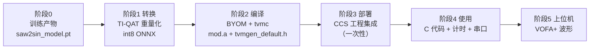

# 教学文档：从训练好的模型到板端运行（saw2sin 全流程）

> **定位**：这份文档是"教材"，讲清 **为什么做 → 怎么做 → 易错点 → 怎么验证**。
> 配套：`README.md`（工程记录：命令、路径、产物）、`saw2sin_tinpu_qat_conv.py`（转换脚本）、
> 实机验证数据：2026-10-06（F28P55 LaunchPad，推理 637.6µs/次）。
>
> 阅读建议：第一遍通读建立全景；第二遍拿板子和文件对着走；最后合上文档做 §9 自测题。

---

## 0. 全景图与心智模型



**心智模型**：NPU 只认一种固定形态的 int8 计算图。我们要用三个"翻译器"把 PyTorch 模型逐层翻译：

| 翻译器 | 谁 | 翻译什么 | 产物 |
|---|---|---|---|
| ① TI-QAT（Python 库） | `tinyml_torchmodelopt` | 把 float 网络 + 权重 → **符合 NPU 硬件约束的 int8 图** | int8 ONNX |
| ② 编译器（TVM 系） | `ti_mcu_nnc` / tvmc | 把 int8 图 → **NPU 微码 + 芯片可链接的 C 库** | mod.a |
| ③ 固件（CCS） | CCS 工程 | 把 C 库 → **烧进芯片的 .out** | 板端运行 |

---

## 1. 阶段 0：起点检查——训练出模型后先回答三个问题

### 1.1 三问

| # | 问题 | 为什么问 |
|---|---|---|
| ① | **batch 是不是 1？** 输入输出什么形状？ | NPU 硬约束：batch 固定为 1；时序数据要整理成窗口形态 `(1,1,frame,1)` |
| ② | **用什么量化？** | 通用量化（fbgemm / ORT QDQ）**上不了 NPU**，必须用 TI-QAT 重做 |
| ③ | **网络算子形态能被硬件匹配吗？** | 编译器只认特定模式（Gemm / 特定卷积形态）；认不出的层静默回落 CPU |

### 1.2 saw2sin 的三个答案（都是踩过的坑）

| 问题 | 当初的状态 | 处理 |
|---|---|---|
| ① batch | 动态 batch | 改成窗口 `(1,1,10,1)` 静态 |
| ② 量化 | fbgemm QAT / ORT QDQ → 只能 CPU | 用 TI-QAT 重做（阶段 1）|
| ③ 形态 | MLP 导出为 `MatMul + 独立Add` → **NPU 零卸载** | 换成数学等价的 **1×1 卷积**（阶段 1.2）|

### 1.3 NPU 硬件约束速查（本工程实测 + 官方文档）

| 约束 | 规则 | 我们遇到的实例 |
|---|---|---|
| batch | 只能 1 | 窗口形态 (1,1,10,1) |
| 数据类型 | 输入/输出/激活 8bit（有无符号均可） | int8 ⇒ dequant 后 float |
| 量化参数 | 权重 per-channel 对称 + **2 的幂 scale**；激活对称 | TI-QAT 帮我们保证 |
| 1×1 卷积（PWCONV） | **输入通道数必须 4 的倍数** | 首层 1 通道被拒 → 回落 CPU |
| 普通卷积（FCONV，>1×1） | 首层输入通道=1 是允许的 | — |
| 全连接（FC） | 8bit 权重要求输入特征 ≥16；4bit ≥8 | 与 MatMul/Gemm 形态问题叠加（见 1.2）|
| 不满足约束 | **自动回落 CPU**（不算错误） | 编译报告的 `[ ]` |

---

## 2. 阶段 1：转换——TI-QAT 重量化

**对应文件**：`saw2sin_tinpu_qat_conv.py`　**运行环境**：conda env `ti-npu`

### 2.1 为什么必须重做量化

| | 通用量化（你原来做的） | TI-QAT（现在做的） |
|---|---|---|
| 工具 | `torch.ao.quantization`（fbgemm）| `tinyml_torchmodelopt`（TI 官方）|
| 权重 scale | 任意 float | **2 的幂**（硬件乘法器要求）|
| 图形态 | 标准 PyTorch 量化图 | TINPU 专用算子替换（right_shift 等）|
| 上 NPU | ❌ 只能 CPU | ✅ |

### 2.2 结构等价替换：MLP → 1×1 卷积（最关键的发现）

**现象**：纯 MLP 直导编译后 NPU 零卸载。**根因**：PyTorch 导出的全连接是 `MatMul+独立Add`，TI 编译器只认 `Gemm` 融合形态；3/4 维张量下 ORT 无法自动融合（只对 2 维生效）。

**解法**：`Linear(1→64)` 与 `Conv2d(1→64, 1×1)` 数学完全等价：

$$y[o,h,w] = \sum_c W[o,c,0,0]\cdot x[c,h,w] + b[o]$$

```python
convnet.net[0].weight.copy_(mlp.net[0].weight.view(64, 1, 1, 1))  # 权重零损失复用
# 脚本自动断言: MLP vs ConvMLP max diff < 1e-5（实测 3.6e-07）
```

> **教学点**：遇到"层不支持"时，先想"能不能用支持的算子组表达同样的数学"。卷积形态走通了 TI 官方的主推路径。

### 2.3 包装 → 微调 → 导出（三段式）

```python
# ① 包装：注入硬件量化约束
qat = TINPUTinyMLQATFxModule(convnet, example_inputs=torch.rand(1,1,10,1),
                             qconfig_type=TinyMLQConfigType(8, 8, auto_quantization=False),
                             total_epochs=15, output_int=False)

# ② QAT 微调（让网络适应量化误差）
for epoch in range(15):
    qat.train()          # ★ 每个 epoch 只调一次！内部靠它推进"温度/冻结"调度
    ... 200 步 forward/backward/step ...
    qat.eval()           # 观察伪量化误差

# ③ 转换 + 导出
qat = qat.convert()                                    # 冻结 scale → 整数运算图
qat.export(dummy_input, "xxx.onnx", opset_version=18)  # ★ opset 必须 18（官方默认）
```

**易错点清单**：
- `train()` 每 epoch 只调一次（wrapper 重写过，会自增 epoch 计数）
- `total_epochs` 必须等于实际训练轮数（温度调度表按它生成）
- `opset_version=18`（wrapper 默认 17 会改变 ORT 融合行为）

### 2.4 三层验证（缺一不可）

```
[equiv] MLP vs ConvMLP max diff = 3.6e-07    ← ① 结构等价性
[float] max err = 4.7e-03                     ← ② 浮点模型基准（对理想正弦）
[int8 ] max err = 4.4e-02                     ← ③ 量化后精度（onnxruntime 逐点推理）
```

**产物**：`saw2sin_tinpu_int8.onnx`（静态 (1,1,10,1) → (1,1,10,1)，float32 进 / float32 出）

---

## 3. 阶段 2：编译——BYOM "只编译"流程

**对应文件**：`saw2sin_compile.yaml`

### 3.1 配置的四个关键点（每条都是坑）

```yaml
common:
  task_type: 'generic_timeseries_regression'
  target_device: 'F28P55'
dataset:
  enable: False            # ① 只编译、不加载数据集
training:
  enable: False
  quantization: 2          # ② ★ 必须写！否则 hard 白编译被降级 type=soft（CPU 软库）
compilation:
  enable: True
  model_path: '...saw2sin_tinpu_int8.onnx'   # ③ 指向阶段 1 产物
# ④ YAML 文件必须纯 ASCII（TI 脚本用系统 GBK 编码打开，中文注释会崩）
```

### 3.2 运行命令

```powershell
$env:C2000_CG_ROOT = 'E:\ccs\ccs\tools\compiler\ti-cgt-c2000_25.11.1.LTS'  # 新终端需要
cd E:\desk\ti-npu\saw2sin_npu
E:\anaconda\envs\ti-npu\python.exe -m tinyml_modelmaker.run_tinyml_modelmaker saw2sin_compile.yaml
```

### 3.3 读卸载报告（每次编译必看）

```
Layer Patterns Offloaded:
  PWCONV      1        ← [X] 上 NPU 的层
Operators not Offloaded:
  qnn.conv2d  2  ...   ← [ ] 回落 CPU 的层
WARNING: PWCONV does not support 1 input channels. Please change to multiples of 4.
```

- `[X]` = 跑在 NPU；`[ ]` = CPU；warning 会写明**不满足哪条硬件约束**
- 我们的结果：中间层 64→64（≈97% 计算量）上 NPU

**产物**：`compilation\artifacts\mod.a`（模型库）+ `tvmgen_default.h`（C 接口头文件）

---

## 4. 阶段 3：部署——CCS 工程集成（**逐项详解**）

> 这是**一次性工作**：以后只有换新模型（重新编译出新的 mod.a 后）需要重做。

### 4.0 改动总表（CCS 工程 `E:\desk\CCS\uart_and_npu`）

| # | 改哪里 | 内容 | 为什么 |
|---|---|---|---|
| 1 | 复制文件 | `artifacts\mod.a` + `tvmgen_default.h` | 模型本体 + C 接口 |
| 2 | 复制文件 | `device\f28p55x_npu.c`（来自 C2000Ware device_support）| **mod.a 依赖它的函数**（见 4.2）|
| 3 | 链接脚本 | `.rodata.tvm → FLASH_BANK0`、`.bss.noinit.tvm → RAMGS3` | **NPU 数据段需要指定落位**（见 4.3）|
| 4 | 构建文件 | makefile / subdir_vars.mk 加 `f28p55x_npu.obj` + `mod.a` | **让新文件被编译、让库进链接**（见 4.4）|
| 5 | 主程序 | 写应用代码 | 见阶段 4 |

### 4.1 文件复制（简单）

```
mod.a                 →  工程\artifacts\mod.a
tvmgen_default.h      →  工程\artifacts\tvmgen_default.h
f28p55x_npu.c         →  工程\device\f28p55x_npu.c   ← 来自 E:\ccs\C2000Ware_26_01_00_00\device_support\f28p55x\common\source\
```

### 4.2 【深入】为什么必须加 `f28p55x_npu.c`？

用 `ofd2000`（C2000 的符号查看工具）检查 mod.a 的**未定义符号表**，发现：

```
NPU_setInstrMem        undefined   ← mod.a 要用，但库里没有
NPU_setParamMem        undefined
NPU_setInterruptHandler undefined
NPU_clearInterruptACK  undefined
```

- 这些函数的**定义**在 C2000Ware 的 `f28p55x_npu.c` 里（负责：把模型微码/参数搬运进 NPU 内存、注册 NPU 中断处理等）
- 如果把 `f28p55x_npu.c` 加进工程 → 链接器从它那里取到实现 → 链接通过
- **不加的症状**：链接报错 `undefined symbol: NPU_setInstrMem`（看到这种错，先查"库需要哪个工程文件提供符号"）
- 官方 AI 例程（C2000Ware `libraries\ai\examples\...`）的 projectspec 里也是复制这个文件进工程 —— 我们和官方做法一致

> 补充：`TINIE_*` 系列符号（TINIE_setup/TINIE_start 等）**不需要外部提供**，它们打包在 mod.a 内部（`tinie_soft.obj` = 算子的 CPU 软件实现，`tinie_c28.obj` = NPU 硬件控制）。

### 4.3 【深入】链接脚本加的那两行，到底是什么？

**先理解三个概念**：

1. **段（section）**：编译后的代码/数据按用途分类存放，各占一个"段"。常见标准段：`.text`（代码）、`.bss`（未初始化变量）、`.const`（常量）……
2. **链接脚本（.cmd）**：规定"每个段放进芯片的哪块存储器"。工程里有两份：`28p55x_generic_flash_lnk.cmd`（FLASH 运行版）和 `28p55x_generic_ram_lnk.cmd`（RAM 调试版）。
3. **自定义段**：mod.a 里带着**两个标准之外的自定义段**——链接脚本不写规则，链接器就不知道它们放哪。

```
.rodata.tvm     ← TVM 生成的只读数据（NPU 微码/参数表等），由 CPU 读取后搬进 NPU
.bss.noinit.tvm ← 运行时工作缓存（可写），NPU 相关的运行数据
```

**加的两行**（放在 SECTIONS 块内，两套 .cmd 都要加）：

```
   /* TI NPU (TINIE) model sections - referenced by artifacts/mod.a */
   .rodata.tvm      : > FLASH_BANK0, ALIGN(8)
   .bss.noinit.tvm  : > RAMGS3
```

**为什么 .rodata.tvm 放 FLASH？**
只读数据（`ro` = read-only），断电不丢、不修改。CPU 在运行时读它（通过 `NPU_setInstrMem/setParamMem` 搬运到 NPU 内存），放 FLASH 最合适。

**为什么 .bss.noinit.tvm 必须放 RAMGS（全局共享 RAM）？**
- F28P55 的 RAM 分两种：**LSx（Local Shared，CPU 子系统本地）** 和 **GSx（Global Shared，全局共享）**
- NPU 是独立硬件，它对内存的访问通道**只覆盖 GS 区域**（C2000Ware 的 `driver_tinie_npu_mapping.h` 里，NPU 的写保护寄存器就是对 GS0~GS3 设置的——硬件设计如此）
- 所以 NPU 相关的可写数据必须落在 GS 银行 → 我们选 **RAMGS3**（2KB，够放 0x520 字节；GS0~2 在链接脚本里已被 `ramgs0/1/2` 段占用）
- `.noinit` = 不初始化（不需要在 FLASH 里存一份初值），链接脚本里也是这么处理的（map 里显示 `compression=zero_init`）

**忘记加的症状**：链接期出现 `creating output section ".rodata.tvm" without a SECTIONS specification` 之类警告 → 段没有有效地址 → 运行时 NPU 数据无效（跑飞/结果错乱）。

**验证方法**（编译后看 map 文件）：
```powershell
Select-String -Path 'CPU1_FLASH\uart_and_npu.map' -Pattern 'rodata\.tvm|noinit\.tvm'
```
应看到类似（我们工程的实际输出）：
```
.bss.noinit.tvm:  run addr=00012000(=RAMGS3起点), run size=00000520
.rodata.tvm:      @ 00080f80 (=FLASH区) size=00000250
```

### 4.4 【深入】构建文件为什么手动加？加在哪？

**先理解 CCS 工程的构建机制**：这个工程真正干活的不是 CCS 界面，而是一堆"自动生成的 makefile"。文件清单分散在两层：

| 文件 | 作用 | 管什么 |
|---|---|---|
| `CPU1_FLASH\device\subdir_vars.mk` | 列出**要编译的源文件**（C_SRCS/OBJS/C_DEPS）| 新 .c 文件必须加这里，才会被编译出 .obj |
| `CPU1_FLASH\makefile` 的 `ORDERED_OBJS` | 列出**链接命令行的全部输入**（obj、库、.cmd）| 新 .obj 和 mod.a 必须加这里，才会进链接 |

**一个 .c 文件要同时出现在两处**：subdir_vars.mk（负责编译它）→ makefile 的 ORDERED_OBJS（负责把它的 .obj 交给链接器）。
**mod.a 只需要加一处**：ORDERED_OBJS（它是现成的库，不用编译）。

我们实际做的修改（CPU1_FLASH 和 CPU1_RAM **两套都要**）：

```
① device\subdir_vars.mk   → C_SRCS/C_DEPS/OBJS 里加入 f28p55x_npu.c 对应条目
② makefile (ORDERED_OBJS) → 加入 "./device/f28p55x_npu.obj" 和 "../artifacts/mod.a"
```

**为什么是"手动"？**
- 这些文件头部都写着 `Automatically-generated file. Do not edit!` —— 它们平时由 CCS 根据工程模型自动生成
- 我们为了不走 CCS GUI，直接手改这些生成文件让 gmake 能编；**代价**：以后如果在 CCS GUI 里改了工程设置（触发重新生成 makefile），我们的手改会被覆盖，需要重新加
- **持久化方案**（可选）：在 CCS GUI 里用 "Add Files" 把 `f28p55x_npu.c` 加进工程、并把 `mod.a` 加为链接资源 —— CCS 会写进工程模型，以后自动生成也带着

**忘记加的症状**：
- 只漏 subdir_vars.mk → 链接报 `file not found: ./device/f28p55x_npu.obj`（没编出来）
- 只漏 ORDERED_OBJS → 链接报 `undefined symbol: NPU_setInstrMem`（编了但没参与链接）
- 漏 mod.a → 链接报 `undefined symbol: tvmgen_default_run`

**验证方法**（编译后看 map，能找到这两行就说明参与链接了）：
```
f28p55x_npu.obj (.text:NPU_setInstrMem)     ← 来自新加的源文件
mod.a : lib0.obj (.text:tvmgen_default_run) ← 来自模型库
```

### 4.5 编译 + 烧录

```powershell
E:\ccs\ccs\utils\bin\gmake.exe -C CPU1_FLASH all
E:\ccs\ccs\ccs_base\DebugServer\bin\DSLite.exe flash --config=TMS320F28P550SJ9_LaunchPad.ccxml CPU1_FLASH\uart_and_npu.out
```
验证：编译 0 error；烧录 exit code = 0。

---

## 5. 阶段 4：使用——C 代码模板

**对应文件**：`empty_driverlib_main.c`（完整实现；原串口回显程序备份为 `.bak`）

### 5.1 推理三件套（固定模板，每次新模型基本不用动）

```c
#include "artifacts/tvmgen_default.h"

static float g_in[10];                       /* 模型输入缓冲 (1,1,10,1) */
static float g_out[10];                      /* 模型输出缓冲 */
static struct tvmgen_default_inputs  g_npu_in;    /* { void* input;  } */
static struct tvmgen_default_outputs g_npu_out;   /* { void* output; } */

g_npu_in.input   = (void *)g_in;             /* 绑定一次即可 */
g_npu_out.output = (void *)g_out;

/* 每次推理： */
tvmgen_default_run(&g_npu_in, &g_npu_out);
while (!tvmgen_default_finished) { }         /* 轮询等完成（标志由 NPU 中断置位）*/
```

> 注意：官方例程里没有显式 `TI_NPU_init()` 调用（头文件里只有声明）——初始化在模型运行库内部完成，照模板写即可。

### 5.2 每次推理计时（CPUTimer 差值法）

```c
t_start = CPUTimer_getTimerCount(CPUTIMER1_BASE);   /* 150MHz 递减计数 */
tvmgen_default_run(&g_npu_in, &g_npu_out);
while (!tvmgen_default_finished) { }
t_end   = CPUTimer_getTimerCount(CPUTIMER1_BASE);

cycles = t_start - t_end;      /* 无符号相减：跨回绕也正确 */
us     = (float)cycles / 150.0f;
```

### 5.3 数据流（你的应用逻辑）

```
生成/采集输入 → 填 g_in[] → 推理 → 读 g_out[] → 使用输出（显示 / 控制 / 上传）
```

### 5.4 串口帧（VOFA JustFloat，字节级说明）

```
每个 float 拆 4 字节小端发送（C28x 是小端）:
  [10 个输入 float] [10 个输出 float] [1 个耗时 float] [帧尾 00 00 80 7F]
```
- 帧尾是 VOFA 识别"一帧结束"的标志；顺序就是"输入 → 输出 → 耗时"
- 实测：637.6µs/次推理，≈120 帧/秒（88 字节/帧 @115200）

---

## 6. 阶段 5：上位机（VOFA+）

| 设置 | 值 |
|---|---|
| 串口 | **COM6**（XDS110 Application/User UART），115200 |
| 协议 | **JustFloat** |
| 通道 | CH0–CH9 输入锯齿 ｜ CH10–CH19 输出正弦 ｜ CH20 推理耗时(µs) |

注意：**同一个 COM 口同一时刻只能被一个程序占用**（VOFA 开着时其它程序读会报"拒绝访问"）。

---

## 7. 复用清单：下一个新模型怎么做

| 阶段 | 改什么 | 不改什么 |
|---|---|---|
| 0 | 三问自查 | — |
| 1 | 脚本里：网络定义 + 权重映射（结构不变则只换权重路径）| 包装/训练/导出代码 |
| 2 | config 一般不动（除非换芯片或换 ONNX 路径）| — |
| 3 | **只需替换** `artifacts\` 两个文件，重新编译烧录 | 链接脚本/构建文件（已配好，不再动）|
| 4 | 输入生成 + 输出处理逻辑 | 推理/计时模板 |
| 5 | VOFA 通道数按新模型 I/O 调整 | — |

**每次必做两个验证**：① 阶段 1 的等价性断言 + onnxruntime 误差；② 编译卸载报告 `[X]` 行。

---

## 8. 坑速查表（按流程顺序）

| # | 坑 | 一句话解法 |
|---|---|---|
| 1 | YAML 中文注释导致 GBK 崩溃 | 配置文件只写 ASCII |
| 2 | `quantization: 2` 漏写 → 编译降级 soft | 写进 config 的 training 段 |
| 3 | MLP 直导零卸载（MatMul+Add 非 Gemm）| 换 1×1 卷积等价表达 |
| 4 | 1×1 卷积首层通道=1 被拒 | 通道数 4 的倍数（或接受回落 CPU）|
| 5 | `C2000_CG_ROOT` 新终端不继承 | 重启 VS Code 或手动 $env: 设置 |
| 6 | mod.a 符号未定义 | 加 f28p55x_npu.c 进工程 |
| 7 | 自定义段没落位 | 链接脚本加 .rodata.tvm / .bss.noinit.tvm 两行 |
| 8 | 新源文件没被编译/链接 | subdir_vars.mk + makefile 两处都加 |
| 9 | 串口被占用 | 同一时刻只开一个程序（VOFA 或读取脚本）|

---

## 9. 自测题（复述用，能全部答出就毕业了）

1. 为什么 fbgemm 量化的 int8 模型上不了 NPU？TI-QAT 保证错了什么？
2. MLP 直导为什么 NPU 零卸载？根因（Gemm/MatMul）和解法（1×1 卷积）讲一遍。
3. 导出时 opset 为什么必须 18？漏了的后果？
4. BYOM 配置里哪个字段不加，编译会静默降级成 CPU 软库？
5. `mod.a` 链接时还缺哪些函数？由哪个工程文件提供？
6. `.bss.noinit.tvm` 为什么不能放 LS RAM？NPU 只能访问哪类内存？
7. 新加一个 .c 文件，构建系统里要改哪两处？各自管什么？
8. 推理计时窗口包含哪些环节？为什么用"递减计数相减"而不是直接读时间戳？
9. JustFloat 帧格式是什么？我们的 21 个通道各是什么？
10. 卸载报告里 `[X]`/`[ ]` 什么意思？举一个"被拒回落"的真实例子和它的硬件原因。

---

## 10. 可选深挖方向（以后想学更深的）

- **精度调优**：QAT 加轮数 / 调 LR，把 4.4e-2 误差压下去（大部分误差来自 1/64 的输出量化台阶）
- **让首层也上 NPU**：输入通道零填充到 4（3 通道填 0，权重也填 0）
- **NPU vs CPU 性能对比**：把同一模型编成 soft/CPU 版，同条件对比耗时
- **更多网络类型**：卷积、池化、多类别分类模型的编译与卸载规则
- **中断式等待**：把 `while(!finished)` 轮询改成 NPU 中断里处理（省 CPU）
